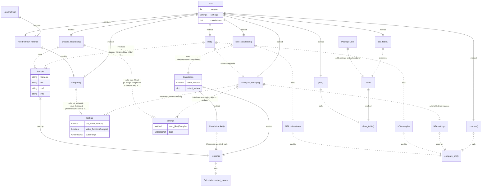

```mermaid
erDiagram
    NTA {
        list samples
        Settings settings
        dict calculations
    }
    Sample {
        string filename
        string dat
        string xml
        string info
    }
    NTA||--||"__init__()": method
    "__init__()"||..|{Sample: "initializes<br/>&<br/>assigns filename (data folder) to…"
    "__init__()"||..||"NTA.samples": sets

    Setting {
        method set_value(Sample)
        function value_function(Sample)
        OrderedDict subsettings
    }
    Settings {
        method read_files(Sample)
        OrderedDict tags
    }
    NTA||--||"configure_settings()": method
    "__init__()"||..||"configure_settings()": "(when done) calls"
    "configure_settings()"||..|{Setting: "initializes (without samples)"
    "configure_settings()"||..|{Settings: "initializes with Setting objects as tags"
    "configure_settings()"||..||"NTA.settings": "sets to Settings instance"

    Calculation {
        function value_function
        dict output_values
    }
    NTA||--||"new_calculation()": method
    "new_calculation()"||..||Calculation: "calls __init__(samples=NTA.samples)"
    "new_calculation()"||..||"NTA.calculations": sets
    Calculation||--||"Calculation.__init__()": method
    Calculation||--||"refresh()": method
    "Calculation.__init__()"||..||"refresh()": "(if samples specified) calls"
    Sample}|--||"refresh()": "used by"
    "refresh()"||..||"Calculation.output_values": "sets"

    NTA||--||"prepare_tabulation()": method
    "prepare_tabulation()"||..|{Sample: uses
    "prepare_tabulation()"||..|{Settings: "calls read_files()<br/>(to assign Sample.xml<br/>& Sample.info) of…"

    NTA||--||"compute()": method
    "compute()"||..|{Setting: "calls set_value() & value_function()<br/>(if set/refresh needed) of…"

    NeedRefresh||--|{"NeedRefresh instance": instance
    NTA||--||"NeedRefresh instance": attribute
    "NeedRefresh instance"||--||"compute()": "used by"

    NTA||--||"add_table()": method
    "add_table()"||..||Table: initializes
    "Package user"||..||Table: "adds settings and calculations"

    Table||--||"draw_table()": method
    NTA||--||"plot()": method
    "plot()"||..||"draw_table()": calls

    NTA||--||"compare()": method
    "compare()"||..||"compare_info()": calls
    "NTA.settings"||..||"compare_info()": "used by"
    "NTA.samples"||..||"compare_info()": "used by"
    "NTA.calculations"||..||"compare_info()": "used by"
```